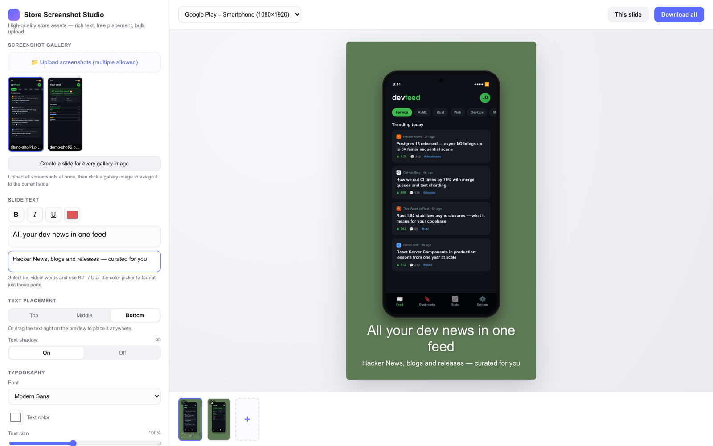
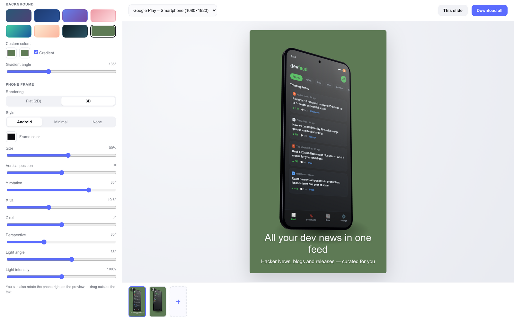

# Store-Screenshot Studio

A free, open-source **App Store screenshot generator** that runs entirely in your browser. Frame your app screenshots in a phone mockup (flat 2D or interactive 3D device frame), place them on a gradient background, add rich-text captions, and export pixel-perfect PNGs in the official App Store and Google Play resolutions — ready to upload to App Store Connect or the Play Console.



Built with Vite, React, TypeScript, Zustand, and three.js. Everything runs locally in your browser — your screenshots never leave your machine.

## Why this exists

When I released my own app, [Kairos](https://play.google.com/store/apps/details?id=com.girskorr.kairos), I needed a quick way to turn plain screenshots into good-looking store listings. Every screenshot builder I found on the web was far too expensive for what it does — so I built my own. Think of it as a free alternative to paid tools like AppMockUp Studio, Previewed, or AppLaunchpad: it doesn't match them feature for feature, but it covers everything you need for a solid first screenshot set and your App Store optimization (ASO) — free, open source, and with no upload of your screenshots to anyone's server.

## Features

- **2D and 3D phone mockups** — a clean flat frame, or a procedurally generated 3D phone (three.js) you can orbit with the mouse, with adjustable rotation, perspective (FOV), and lighting

  
- **Gradient backgrounds** — preset palettes plus fully custom colors and angle
- **Rich-text captions** — headline and subline with per-selection bold/italic/color/size, draggable directly on the canvas
- **Multi-slide projects** — manage a whole screenshot set with live thumbnails
- **Store-ready export** — PNG export at full target resolution (e.g. 1290×2796 for the 6.9" iPhone), pixel-identical to the preview

## Getting started

### Prerequisites

- [Node.js](https://nodejs.org/) 20.19+ or 22.12+ (required by Vite)
- npm (comes with Node.js)

### Installation

```bash
git clone https://github.com/Girskorr/screenshot-studio.git
cd screenshot-studio/screenshot-studio
npm install
```

### Run the dev server

```bash
npm run dev
```

Then open the printed URL (usually `http://localhost:5173`) in your browser.

### Other commands

All commands run from the `screenshot-studio/` directory:

| Command | Description |
| --- | --- |
| `npm run dev` | Start the development server |
| `npm run build` | Type-check and create a production build in `dist/` |
| `npm run preview` | Serve the production build locally |
| `npm run lint` | Lint the source with oxlint |

There is no backend — the production build in `dist/` is a static site you can host anywhere (GitHub Pages, Netlify, etc.).

## Usage

1. **Upload** one or more app screenshots into the gallery.
2. **Pick a format** (store target resolution) and assign a screenshot to each slide.
3. **Style it**: choose 2D or 3D mode, tweak the phone placement, background gradient, and typography; drag the caption or orbit the 3D phone directly in the preview.
4. **Export** the current slide (or all slides) as full-resolution PNGs.

## Architecture

The repository root contains release-asset tooling; the app itself lives in [`screenshot-studio/`](screenshot-studio/).

The core design rule: **the canvas rendering pipeline in [`src/render/`](screenshot-studio/src/render/) is framework-free plain TypeScript** — React only owns the controls and mounts canvases. Preview, slide thumbnails, and PNG export all call the same `renderTo()` entry point, which guarantees they stay pixel-identical.

- `src/render/render.ts` — single rendering entry point: background → phone → rich text, always at full target resolution
- `src/render/phone.ts` / `phone3d.ts` — the 2D frame and the three.js 3D phone (offscreen WebGL canvas composited into the 2D canvas)
- `src/render/richtext.ts` — contenteditable HTML → styled runs → manual word-wrap → canvas text drawing
- `src/store.ts` — Zustand store; structurally extends the render settings so the whole store can be passed to `renderTo()`
- `src/components/` — one React component per control panel group, plus preview, slide strip, and export stage

Note: code comments are in German; the UI is in English.

## Contributing

Issues and pull requests are welcome. Before submitting a PR, please run `npm run build` (type-check) and `npm run lint` from `screenshot-studio/`.

## License

[MIT](LICENSE)
